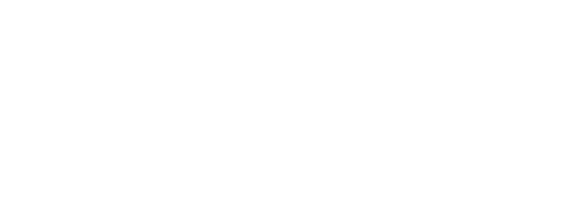
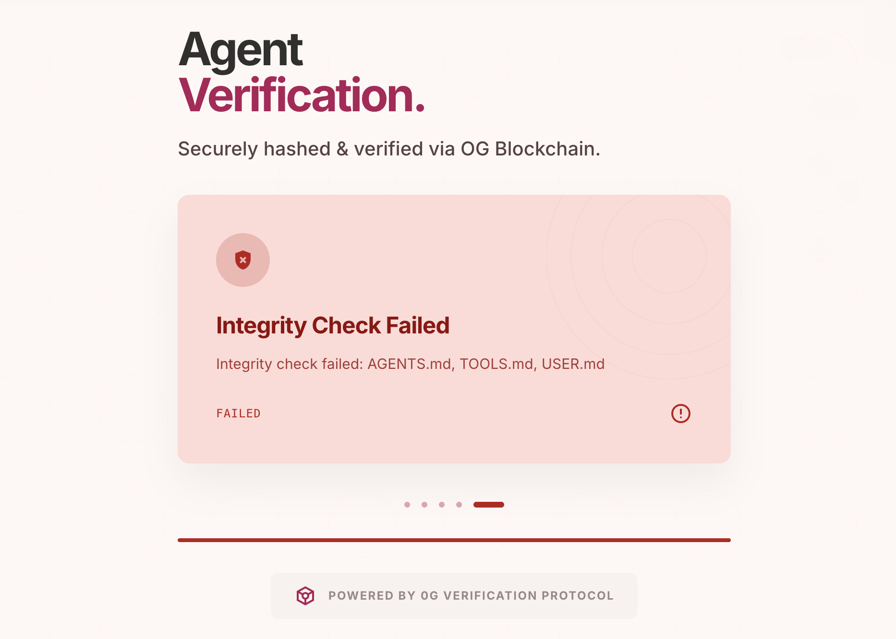

> Gianfran.co:
# 🌴 Croisette.cc



Agentic investment platform - ETH Global Cannes 2026

## Description

Croisette Finance is built to eliminate the "headache" and intimidation often associated with traditional investing. Currently, 55% of people leave their money in bank accounts where it loses value to inflation, and 80% of everyday investors lose money because they lack the time or expertise to manage complex portfolios. Croisette fixes this by replacing expensive brokers and "bankers' hours" with intelligent AI agents that work 24/7/365.

## Tech Stack

### Agents Engine

The core of Croisette is a Next.js app with a backend that orchestrates different instances of
[ZeroClaw](https://github.com/zeroclaw-labs/zeroclaw) Agents with 0G's LLMs using [0G-Compute-Adapter](https://github.com/claraverse-space/0G-Compute-Adapter). The app has a chatbot UI designed to teach the user and help them build healthy investment portfolios based on their personal parameters. The ZeroClaw Agents are spawned using the Agent Control Protocol (ACP).

Available Agents:

- Portfolio Builder Agent: A ZeroClaw agent that acts as a financial concierge, guiding users through portfolio construction. It assesses risk tolerance, time horizon, and goals to recommend diversified allocations. The agent has seven specialized skills: *cash-emergency-fund* (building yield-bearing stablecoin emergency reserves), *fire-calculator* (Financial Independence / Retire Early scenario analysis), *investing-fundamentals* (mapping TradFi concepts to DeFi equivalents), *investment-strategy* (DCA, lump sum, or hybrid deployment plans), *portfolio-allocation* (the core risk-assessed allocation engine), *risk-mindset* (volatility psychology and panic-selling prevention), and *understanding-costs* (fee impact analysis and optimization). It reads available assets from a local SQLite database and writes confirmed portfolio JSON files to the portfolios/ directory.

- Portfolio Manager Agent: A heartbeat-driven ZeroClaw agent that keeps a user's on-chain portfolio aligned with their target strategy. On each cycle it snapshots on-chain token balances, prices them via the Uniswap Trading API against USDC, compares current allocations to the target strategy stored in the SQLite database, and prepares rebalancing swap quotes (BEST_PRICE routing across Uniswap V2/V3/V4). It then sends numbered swap proposals to the user via Telegram and waits for explicit per-swap approval before executing: it never trades autonomously. The agent has five specialized skills: *portfolio-manager* (the orchestration heartbeat cycle), *portfolio-snapshot* (on-chain balance and valuation fetching), *swap-preparation* (quote generation and slippage validation), *swap-execution* (quote refresh, simulation, signing via cast, and broadcast), and *usdc-bridge* (cross-chain USDC bridging).


### 0G Agent Verification Technology

Croisette introduces an agent verification layer built on 0G Storage. Before an agent goes live, a manifest containing the hashes of all its core prompt files (SOUL.md, IDENTITY.md, AGENTS.md, TOOLS.md, etc.) is committed to the blockchain. At runtime, the verification system re-hashes the files the ZeroClaw instance is actually running and compares them against the on-chain manifest. If any file has been tampered with, for example through a prompt injection that modifies the agent's instructions, the mismatch is detected and the agent is flagged as compromised. This protects users from silently altered agent behavior and ensures that the agent they interact with is exactly the one that was audited and published.

On-chain agent files: [0x8f61…1e24 on 0G StorageScan](https://storagescan-galileo.0g.ai/address/0x8f6146916184f626291CD6EDC3A9B14C03691e24)



### Uniswap and Arc Integration

Croisette uses the Uniswap Trading API as its quoting and swap routing provider, combined with [cast](https://book.getfoundry.sh/reference/cast/) (Foundry's Ethereum CLI) to manage agent wallets and execute on-chain settlement transactions. We found cast to be exceptionally reliable for agent-driven workflows because agents work very well with CLI tools. In the same way, we integrated the Arc testnet to allow users to obtain yield through yield-bearing stablecoins and by depositing into lending protocols that pay interest on deposits. To make the agents expert in both integrations, we built dedicated skills for swap preparation, swap execution, and USDC bridging.

The ZeroClaw agent in charge of performing these actions has the following skills:

- portfolio-manager: The orchestration entry point triggered on every heartbeat cycle. Runs a strict 7-step pipeline: fetch supported assets and target allocations from the database, snapshot on-chain state, compare against strategy, prepare swaps, propose via Telegram, parse per-swap approval, and execute approved trades.
- portfolio-snapshot: Fetches the current on-chain portfolio state for the managed wallet. Reads balances for all supported assets, prices them via the Uniswap Trading API against USDC, and computes current allocation percentages at asset and section level. Works on both Ethereum mainnet and Sepolia testnet.
- swap-preparation: Converts rebalance actions into validated Uniswap quote packages. Checks token approvals, fetches quotes via the Trading API (BEST_PRICE routing, V2/V3/V4 protocols), and validates slippage, price impact, and gas conditions. Proposal-mode only: never calls /swap, never signs, never broadcasts.
- swap-execution: Executes user-approved swaps on-chain. Refreshes quotes (never reuses stale ones), runs simulation preflight via /swap, signs transactions using cast, broadcasts them, and reports transaction hashes. Only runs after explicit per-swap user approval via Telegram.
- usdc-bridge: Bridges USDC from Ethereum Sepolia to Arc Testnet using Circle's CCTP (Cross-Chain Transfer Protocol) via cast. Burns USDC on Sepolia and mints native USDC on Arc Testnet, used for funding the Arc emergency-liquidity sleeve.


## Useful Commands

Init ZeroClaw agents:
```
zeroclaw onboard --config-dir .zeroclaw/agents/<agent-name>/
```


Create Symbolic links:
```
ln -s /Users/gianfrancobazzani/GitHub/croisette.cc/portfolios /Users/gianfrancobazzani/GitHub/croisette.cc/.zeroclaw/agents/portfolio-builder-deepseek/workspace/portfolios
```

```
ln -s /Users/gianfrancobazzani/GitHub/croisette.cc/sqlite.db /Users/gianfrancobazzani/GitHub/croisette.cc/.zeroclaw/agents/portfolio-builder-deepseek/workspace/sqlite.db
```

To configure allowed roots for portfolio paths:
```
[autonomy]
allowed_roots = [
  "/Users/gianfrancobazzani/GitHub/croisette.cc/portfolios",
]
```
